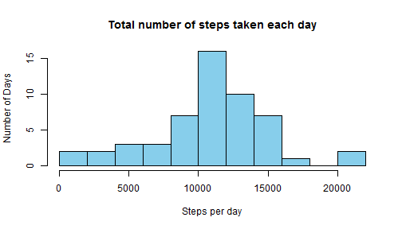
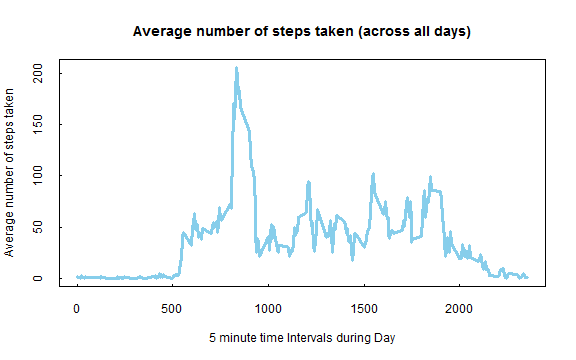
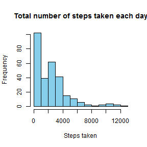
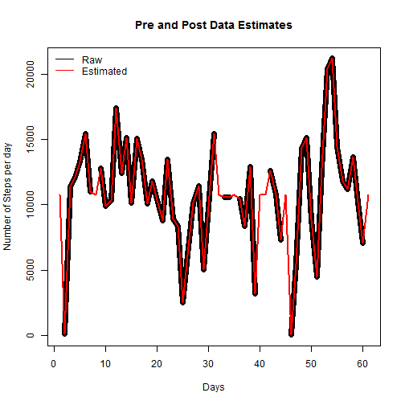
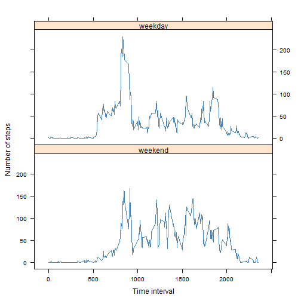

Reproducible Research: Peer Assessment 1
========================================================


## Introduction

It is now possible to collect a large amount of data about personal movement using activity monitoring devices.  
This assignment makes use of data from a personal activity monitoring device. This device collects data at 5 minute intervals through out the day. The data consists of two months of data from an anonymous individual collected during the months of October and November, 2012 and include the number of steps taken in 5 minute intervals each day.  

### Environment
- R 3.0.3+ and R-Studio (0.98.501)
- R Package knitr
- R Package Lattice
- Sensor data "activity.zip"

## Loading and preprocessing the data

Loading 'activity.csv' directly from the "activity.zip" as stored and provided in Github at [https://github.com/scarrk/RepData_PeerAssessment1](https://github.com/scarrk/RepData_PeerAssessment1).
This is read into a data frame.


```r
data <- read.table(unz("activity.zip", "activity.csv"), header = TRUE, quote = "\"", 
    sep = ",", na.strings = "NA", colClasses = c("numeric", "character", "numeric"))
```


## What is mean total number of steps taken per day?

First we calculate the total number of steps by summing the steps taken for each day by using
the aggregate function.  This provides us the total number of steps per day into the variable
'dailyCount'.


```r
dailyCount <- setNames(aggregate(data$steps, list(day = data$date), sum), c("date", 
    "steps"))

hist(x = dailyCount$steps, main = "Total number of steps taken each day", breaks = 10, 
    xlab = "Steps per day", ylab = "Number of Days", col = "skyblue")
```

 


Now calculate the mean and median across the daily data sets, ignoring missing (NA) values and round 
to zero decimal places.


```r
mean_stepsday <- round(mean(dailyCount$steps, na = TRUE), 0)

median_stepsday <- round(median(dailyCount$steps, na = TRUE), 0)
```


**The mean number of steps per day is** 1.0766 &times; 10<sup>4</sup>  
**The median number of steps per day is** 1.0765 &times; 10<sup>4</sup>  


## What is the average daily activity pattern?

To find the average daily activitity pattern a mean of all the same
time intervals across all the days is calculated, with the end result
being an 'average' daily pattern as shown below (entries with missing
values are ignored).


```r
intervalAgg <- setNames(aggregate(data$steps, list(day = data$interval), mean, 
    na = TRUE), c("interval", "steps"))

plot(x = intervalAgg$interval, y = intervalAgg$steps, type = "l", xlab = "5 minute time Intervals during Day", 
    ylab = "Average number of steps taken", main = "Average number of steps taken (across all days)", 
    col = "skyBlue", lwd = 3, tck = 0.01)
```

 


*Which 5-minute interval, on average across all the days in the dataset, contains the maximum number of steps*


```r
max_row <- intervalAgg[intervalAgg$steps == max(intervalAgg$steps), ]
max_rounded <- round(max(intervalAgg$steps), 0)
```


**The interval** 835 on average, contains the maximum number of steps across all the days
with 206 (206.1698)


## Inputing missing values

**Calculate and report the total number of missing values in the dataset (i.e. the total number of rows with NAs)**


```r
missing_values_count <- nrow(data[is.na(data$steps), ])
```


There are 2304 missing values in the data-set (rows with NAs).

*Devise a strategy for filling in all of the missing values in the dataset. The strategy does not need to be sophisticated*

The approach will infill missing values by using the relevant interval from the "Average Daily Activity Pattern" aka the 'intervalAgg' object. These retrieved values will be rounded to 0 decimal places.

**Create a new dataset that is equal to the original dataset but with the missing data filled in**

Copy the original data to 'filledData'and then identify each missing value (is.na) then use it's time interval as a 
lookup into the intervalAgg (interval Aggregation) object where column '2' is the recorded steps and then round
the value to zero decimal places.


```r
filledData <- data

filledData$steps[is.na(filledData$steps)] <- round(intervalAgg[intervalAgg$interval == 
    intervalAgg$interval, 2], 0)
```


*Histogram of the total number of steps taken each day.*  

Create a new aggregate based on the filled in data set to show Total number of steps taken each day.


```r
intervalFilledAgg <- setNames(aggregate(filledData$steps, list(day = filledData$interval), 
    sum), c("interval", "totalSteps"))

hist(x = intervalFilledAgg$totalSteps, main = "Total number of steps taken each day", 
    xlab = "Steps taken", ylab = "Frequency", col = "skyBlue")
```

 


*Create mean and median total number of steps taken per day from this new 'infilled' dataset*

Create a new set of daily aggregates based on the new filledData object. Then create the mean and median.


```r
dailyFilledCount <- setNames(aggregate(filledData$steps, list(day = filledData$date), 
    sum), c("date", "steps"))

mean_filledstepsday <- round(mean(dailyFilledCount$steps, na = TRUE), 0)

median_filledstepsday <- round(median(dailyFilledCount$steps, na = TRUE), 0)
```


*Compare these values from the estimates from the first part of the assignment?*

Creating a small grid to show the mean and median values from the raw and filled data. Using the data infill method defined above, there is no impact to the overal mean value of daily steps per day
and a small change to the median (3 steps per day) see below.


```r
averages <- rbind(c(mean_stepsday, median_stepsday), c(mean_filledstepsday, 
    median_filledstepsday))
colnames(averages) <- c("mean", "median")
rownames(averages) <- c("raw", "filled")
averages
```

```
##         mean median
## raw    10766  10765
## filled 10766  10762
```


*What is the impact of inputing missing data on the estimates of the total daily number of steps?*

You will see little impact by including estimates in this data due to the algorithm used.
The missing data covered a whole day of intervals for 8 days during the monitoring period.  
By using the average for each missing interval (the entire day for these 8 days) all followed the average
day pattern and thus did not contribute any out of range values (e.g, no new high or low counts for steps
per day).  

This chart shows the raw data in black and the estimated data in red, for the monitoring period, you will
see the estimated/infilled data set closely follows the raw data.


```r
plot(dailyCount$steps, type = "l", col = 1, lwd = 7, main = "Pre and Post Data Estimates", 
    xlab = "Days", ylab = "Number of Steps per day")
lines(dailyFilledCount$steps, col = 2, lwd = 2)  #Estimated data set
legend("topleft", bty = "n", lty = "solid", c("Raw", "Estimated"), col = c("black", 
    "red"))
```

 


## Are there differences in activity patterns between weekdays and weekends?

**Create a new factor variable in the dataset with two levels - "weekday" and "weekend" indicating whether a given date is a weekday or weekend day.**

I convert the date field to a Day of the week value and then convert to either a weekend or weekday value.
This new value 'filledData$day' is then turned into a factor variable with 2 levels.


```r
# Define a weekend and weekday set - Not using %u or %w weekday as a decimal
# to aid readability
weekend <- c("Saturday", "Sunday")
weekday <- c("Monday", "Tuesday", "Wednesday", "Thursday", "Friday")

filledData$day <- weekdays(strptime(filledData$date, format = "%Y-%m-%d"))
filledData$day[filledData$day %in% weekend] <- "weekend"
filledData$day[filledData$day %in% weekday] <- "weekday"
filledData$day <- factor(filledData$day)
```


**Weekday vs weekend patterns**

This figure shows the average weekday against the average weekend.  
The script calculates the we_agg across all rows marked as weekend and then calculates the wd_agg 
for all all rows marked as weekday.
Both of these results are merged and a factor created for the day type (weekend/weekday) before the
plot is constructed.


```r
library(lattice)
we_agg <- round(aggregate(filledData$steps[filledData$day == "weekend"], list(day = filledData$interval[filledData$day == 
    "weekend"]), mean), 0)
we_agg <- cbind(we_agg, rep("weekend", nrow(we_agg)))
colnames(we_agg) <- c("interval", "steps", "daytype")
wd_agg <- round(aggregate(filledData$steps[filledData$day == "weekday"], list(day = filledData$interval[filledData$day == 
    "weekday"]), mean), 0)
wd_agg <- cbind(wd_agg, rep("weekday", nrow(wd_agg)))
colnames(wd_agg) <- c("interval", "steps", "daytype")
wdwe_agg <- rbind(we_agg, wd_agg)
wdwe_agg$daytype <- factor(wdwe_agg$daytype)

xyplot(wdwe_agg$steps ~ wdwe_agg$interval | wdwe_agg$daytype, type = "l", layout = c(1, 
    2), ylab = "Number of steps", xlab = "Time interval", lwd = 1, col = "steelBlue")
```

 

